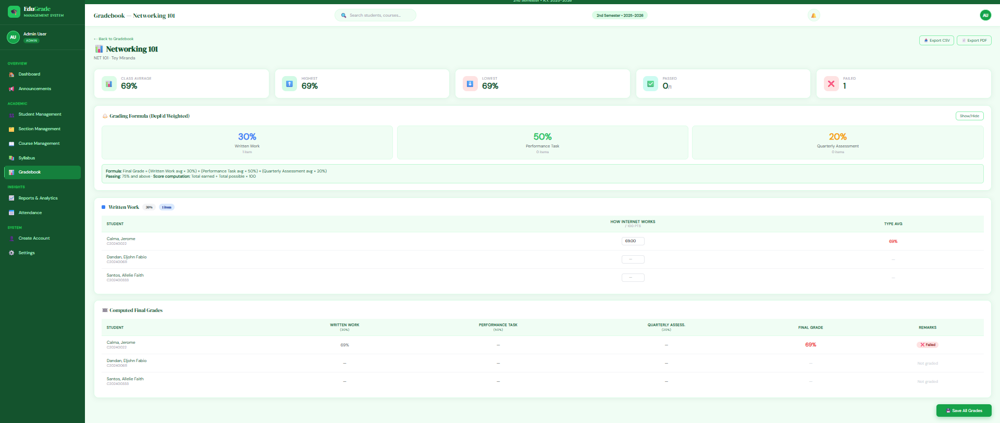
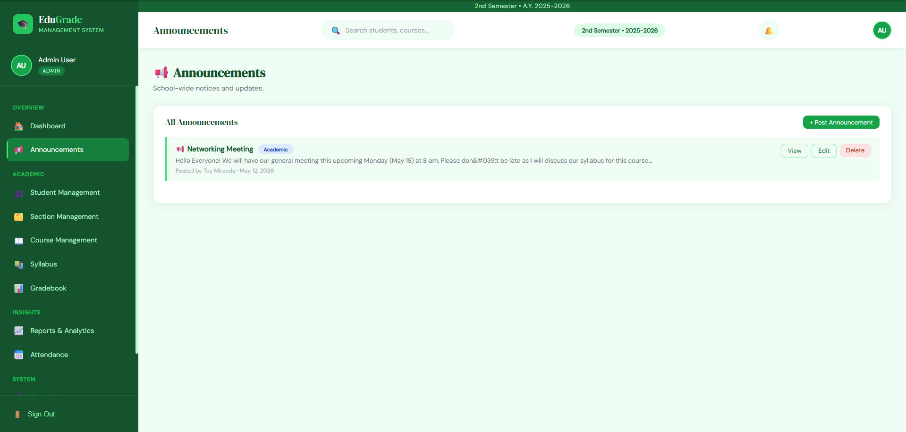

# 🎓 EduGrade — School Grading Management System

A web-based academic management system built with Laravel 12. EduGrade provides role-based access for **Admins**, **Teachers**, and **Students** to manage grades, attendance, announcements, and more.

---

## 📸 Screenshots

### Admin Dashboard


### Student Dashboard


### Gradebook


### Student Management


### Student Profile


### Section Management


### Course Management


### Attendance Tracking


### My Attendance (Student View)


### My Grades (Student View)


### My Syllabus (Student View)


### Announcements (Admin)


### Announcements (Student View)


### Reports & Analytics


### System Settings


### Create Account


---

## ✨ Features

- **Role-Based Access** — Separate portals for Admins, Teachers, and Students
- **Admin Dashboard** — Overview of total students, active courses, assignments, and school average
- **Student Dashboard** — Personal academic overview including schedule, grades, and announcements
- **Gradebook** — Manage grades with weighted formula (Written Work, Performance Task, Quarterly Assessment)
- **Student Management** — Add, edit, view, and delete student records with full profile view
- **Section Management** — Organize students into sections with schedule support
- **Course Management** — Create and manage courses with grading weights and enrolled students
- **Attendance Tracking** — Record and monitor student attendance per course
- **Syllabus** — Upload and view course syllabi per section
- **Announcements** — Post and view school-wide or course-specific announcements
- **Reports & Analytics** — Generate academic performance reports, exportable to CSV and PDF
- **System Settings** — Configure active semester and school year shown across the system
- **Create Account** — Admin can create Admin, Teacher, or Student accounts

---

## 🛠️ Tech Stack

| Technology | Version |
|---|---|
| PHP | 8.2 |
| Laravel | 12 |
| MySQL | 10.4 (MariaDB) |
| Tailwind CSS | 3 |
| Vite | 7 |

---

## ⚙️ Installation & Setup

### Requirements
- PHP 8.2+
- Composer
- Node.js & npm
- MySQL / MariaDB

### Steps

1. **Clone the repository**
   ```bash
   git clone https://github.com/itsmarlie/grading-system.git
   cd grading-system
   ```

2. **Install PHP dependencies**
   ```bash
   composer install
   ```

3. **Install JS dependencies**
   ```bash
   npm install
   ```

4. **Set up environment**
   ```bash
   cp .env.example .env
   php artisan key:generate
   ```

5. **Configure your database** in `.env`
   ```env
   DB_CONNECTION=mysql
   DB_HOST=127.0.0.1
   DB_PORT=3306
   DB_DATABASE=your_database
   DB_USERNAME=root
   DB_PASSWORD=
   ```

6. **Run migrations and seeders**
   ```bash
   php artisan migrate --seed
   ```

7. **Start the development server**
   ```bash
   php artisan serve
   npm run dev
   ```

8. **Visit** `http://127.0.0.1:8000`

---

## 👥 Developers

- **Marlie Tolentino**
- **Eljohn Fabio Dandan**

---

## 📄 License

This project is open-source and available under the [MIT License](LICENSE).